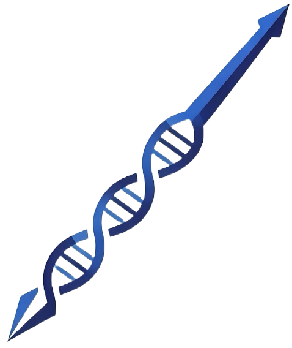

<p align="center">
  
</p>

# Gungnir
Gungnir codec enabling high error-tolerance and low-redundancy DNA storage through substantial computing power

[](https://opensource.org/licenses/BSD-3-Clause)

Contact: Ruibang Luo, Jingcheng Zhang  
Email: {rbluo,zhangjc}@cs.hku.hk

## Introduction
DNA has emerged as a compelling archival storage medium, offering unprecedented information density and millennia-scale durability. Despite its promise, DNA-based data storage faces critical challenges due to error-prone processes during DNA synthesis, storage, and sequencing. In this study, we introduce Gungnir, a codec system using the proof-of-work idea to address substitution, insertion, and deletion errors in a sequence. With a hash signature for each data fragment, Gungnir corrects the errors by testing the educated guesses until the hash signature is matched. For practicality, especially when sequenced with nanopore long-read, Gungnir also considers biochemical constraints including GC-content, homopolymers, and error-prone motifs during encoding. In silico benchmarking demonstrates its outperforming error resilience capacity against the state-of-art methods and achieving complete binary data recovery from a single sequence copy containing 20% erroneous bases. Gungnir requires neither keeping many redundant sequence copies to address storage degradation, nor high-coverage sequencing to address sequencing error, reducing the overall cost of using DNA for storage. 

This repository provides a complete toolkit for running sample test, including encoding/decoding algorithms, simulation tools, and practical examples. 

## Content
- [Introduction](#introduction)
- [Installation](#installation)
  - [Install go 1.23](#1install-go-123)
  - [Get Gungnir source code](#2get-gungnir-source-code)
- [Quick Start](#quick-start)
  - [DNA Encoding](#1-dna-encoding)
  - [Add Noise](#2-add-noise)
  - [DNA Decoding](3-dna-decoding)
  - [Reconstruction](#4-reconstruction)
  - [Expected Output](#5-expected-output)
- [Customized Usage](#customized-usage)

## Files Tree Diagram
```
Gungnir
├── error_pattern
│   └── ...                                  # Error handling patterns
├── examples
│   └── main.go                              # Example usage code
├── files
│   └── The Ugly Duckling                    # Sample test file
│   └── Summer Flowers                       # Simple test case
├── tools
│   ├── decode.go                            # DNA decoding
│   ├── decode_three.go                      # Ternary DNA decoding
│   ├── distance.go                          # Distance calculation
│   ├── encode.go                            # DNA encoding
│   ├── exclude.go                           # Invalid motifs
│   ├── functions.go                         # Encapsulate callable functions
│   ├── hash.go                              # Hash functions
│   ├── params.go                            # Parameters
│   ├── readfile.go                          # File reading functions
│   └── simulation.go                        # Error simulation
├── .gitignore                               # Git ignore
├── LICENSE                                  # Project license
├── README.md                                # Description file
├── go.mod                                   # Go module
└── go.sum                                   # Dependency checksums
```
## Installation
### 1.Install go 1.23
Download and install Golang from the official website (https://golang.org/dl/).
```
# Download the latest Golang version 1.23 by visiting the official website (https://golang.org/dl/) and, 
# copying the download link for the Linux tarball.
# An example is shown below:
wget https://golang.org/dl/go1.23.10.linux-amd64.tar.gz

# Extract the downloaded tarball to your preferred local directory. In this example, we'll use `$HOME/.local`:
mkdir -p $HOME/.local
tar -xvzf go1.23.10.linux-amd64.tar.gz -C $HOME/.local

# Remove the tarball after extraction
rm go1.23.10.linux-amd64.tar.gz

# Set up your Go workspace and environment variables
## Create the required directory structure:
mkdir -p $HOME/go/{bin,src,pkg}

## add link to bashrc or .profile
## add the GOPATH,GOROOT to your `~/.bashrc` or `~/.profile`
echo 'export GOPATH=$HOME/go
export GOROOT=$HOME/.local/go
export PATH=$PATH:$GOROOT/bin:$GOPATH/bin' >> ~/.bashrc
source ~/.bashrc

## Verify the installation
## You will get "go version go1.23.10 linux/amd64" if installed successfully
go version
```
### 2.Get Gungnir source code
You can clone this repo as following:
```
mkdir Gungnir_RootFolder
cd Gungnir_RootFolder
git clone https://github.com/HKU-BAL/Gungnir.git
cd Gungnir/examples

```
## Quick Start
This section demonstrates the basic workflow of our DNA storage system. The following commands will encode a file into DNA sequences, simulate sequencing errors, decode the noisy sequences, and reconstruct the original file.
### 1. DNA Encoding
Convert your digital file into DNA sequences (A, T, C, G). This process will generate an *Origin* file inside the *Outcome* directory.
```
go run main.go -action Encode -input "../files/Summer Flowers" -output "../Outcome"
```
Default parameters apply the Gungnir method at 0.8 density, you can modify these by applying optional parameters.
### 2. Add Noise
Simulate DNA sequencing errors aiming at testing the robustness of the codec.
```
go run main.go -action AddNoise -output "../Outcome"
```
This adds 1% substitution, 1% insertion, and 1% deletion errors by default.

### 3. DNA Decoding
Decode the noisy DNA sequences with error correction. This process will generate an *Decoded* file inside the *Outcome* directory.
```
go run main.go -action Decode -output "../Outcome"
```
The decoder automatically corrects errors using advancing edit distance algorithms.
### 4. Reconstruction
Rebuild the original file from the decoded data.
```
go run main.go -action Reconstruction -output "../Outcome"
```
After this step, your original file will be recovered in *output* file inside the *Outcome* directory.


### 5. Expected Output
A quick run of the program produces the following terminal output for each step.

Encodes: Encodes the source file into DNA strands.

```
Strand Num:  141
```

Add Noise: Simulates errors in the DNA strands. No terminal output is expected.

Decode: Performs error correction and decodes the data.

```
Decoded finished, Hmax: 100000
Total Sequences: 141  Failure Sequnces: 0
First round Finished at Edit Distance upperbound:  3
Second round begin!
Total Sequences: 141  Failure Sequnces: 0
0  sequences with no output! Hmax: 1000000
0  no ouput,  0  fixed!
Total Sequences: 141  Failure Sequnces: 0
Second round Finished at Edit Distance upperbound:  3
Total Sequences: 141  Failure Sequnces: 0  Mistaken Sequences: 0
Data recovery:  1  Precision:  1  Recall:  1
```

Reconstruction: Rebuilds the original file from the decoded data. No terminal output is expected.

Final Output Files:

The `Outcome/` directory will contain the following files, where `output` is the final reconstructed file.

```
Outcome/
├── Add_Error
├── Decoded
├── Origin
├── output
└── whetheroutput
```

To verify, the `output` file should be identical to the original input file.

## Customized Usage
Adjust information density：
```
go run main.go -action Encode -input "../files/Summer Flowers" -output "../Outcome" -density 0.7
```
Flexible sequence length：
```
go run main.go -action Encode -input "../files/Summer Flowers" -output "../Outcome" -length 200
```
Simulate different error rate:
```
go run main.go -action AddNoise -output "../Outcome" -sub 0.02 -ins 0.02 -del 0.02
```
Enable Multi-threading (thread1: sequences processed in parallel; thread2: goroutine for each sequence):
```
go run main.go -action Decode -output "../Outcome" -thread1 4 -thread2 2
```
Our codec provides 3 types of methods for different utility:
Gungnir-ONT:
```
go run main.go -action Encode -input "../files/Summer Flowers" -output "../Outcome" -option Gungnir-ONT -density 0.7
go run main.go -action Decode -output "../Outcome" -option Gungnir-ONT -density 0.7
```
Gungnir-Trit:
```
go run main.go -action Encode -input "../files/Summer Flowers" -output "../Outcome" -option Gungnir-Trit -density 1.11
go run main.go -action Decode -output "../Outcome" -option Gungnir-Trit -density 1.11
```
>[!Note]
>Gungnir and Gungnir-ONT support density range: [0.5-0.9]  
>Gungnir-Trit supports density range: [0.5-1.5]

Limiting Output Sequences:
```
go run main.go -action Encode -input "../files/Summer Flowers" -output "../Outcome" -seqnum 50
```
Fixed or Adaptive Error Correction:
```
# Use fixed edit distance (faster but less flexible)
go run main.go -action Decode -output "../Outcome" -DecodeEDmax=false -EDmax 5
# Use advancing edit distance (default, more robust)
go run main.go -action Decode -output "../Outcome" -DecodeEDmax=true
```


